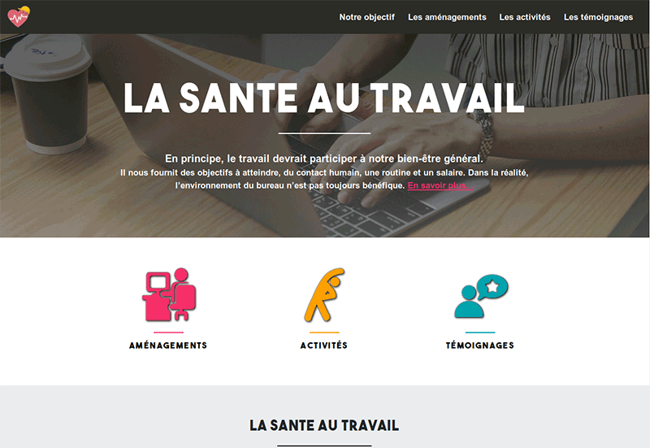

# Occupational health website

Website for highlight occupational health.
* To suggest doing exercises on your workplace, for improve your physical condition
* To suggest doing convert your office to ergonomic office 
 

### Installing

* Clone the project `git clone https://github.com/Amandine1345/201810-la-sante-au-travail-website.git`

* Open `index.html` in your favorite browser

### Build With
* HTML 5
* CSS 3
* Bootstrap 4

### Versioning
* Git
 
### Contributors

* Patricia Batjorm - [PBAT75](https://github.com/PBAT75)
* Thomas Coumes - [ThomasCms](https://github.com/ThomasCms)
* Vivien Piveteau - [Vivpiv](https://github.com/vivpiv)
* Amandine Turpin - [Amandine1345](https://github.com/Amandine1345)

###### Duration of the project : 3 weeks